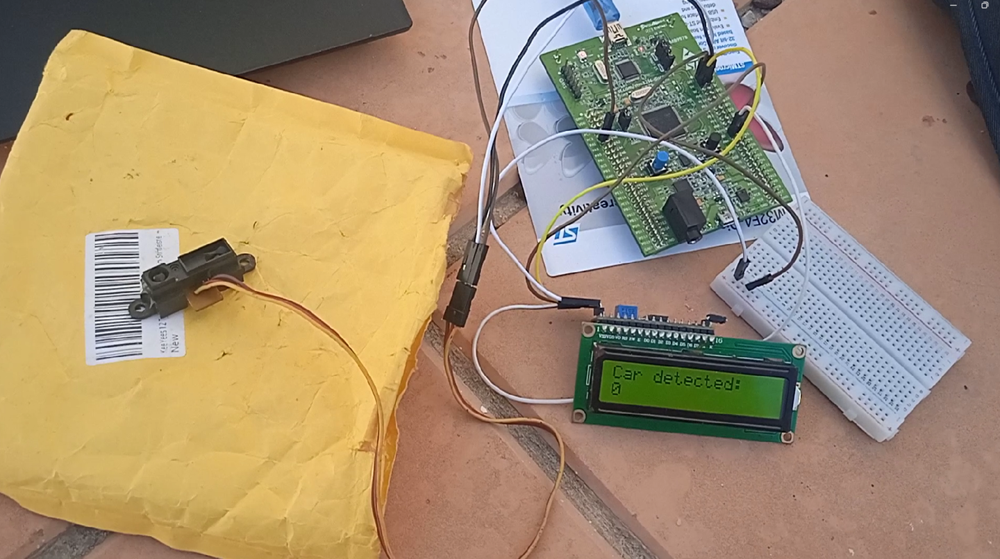
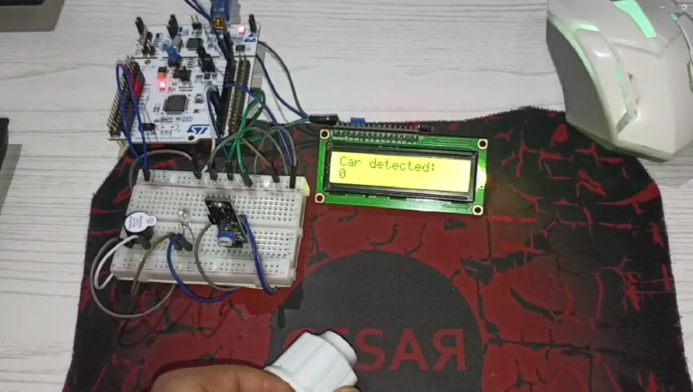

# 🛣️ Traffic-flow-detection-system
This project is a prototype real-time traffic monitoring system that uses an STM32 microcontroller for vehicle counting, data logging, and traffic analysis.

## 📄 Description
This project implements a prototype real-time traffic monitoring system built on an STM32 microcontroller, designed to provide accurate vehicle flow counting and data logging for intelligent transportation applications.

The prototype uses traffic detection sensors (infrared, ultrasonic, or other suitable types) strategically placed along the road or entry/exit points to detect and count passing vehicles. The STM32 acts as the central processing unit, handling sensor data acquisition, signal processing, and event management in real-time.

In this project, the traffic monitoring system was implemented using **two different hardware approaches** to demonstrate the versatility of the prototype. The first approach uses an STM32F407 Discovery board paired with an ultrasonic sensor and an I²C LCD display to visualize traffic information in real time, providing a comprehensive narrative walkthrough of the system’s real-time vehicle detection, data logging, and traffic analysis capabilities. The second approach uses an STM32 Nucleo board with an infrared sensor and an I²C LCD display, offering a simpler demo to illustrate the core functionality of vehicle counting and data acquisition. Both setups showcase the system’s adaptability to different microcontrollers and sensor types while maintaining accurate traffic monitoring performance.

## ⚙️ Tools and Technologies

### 1. STM32 Discovery + Analog Infrared Sensor Approach 
#### 1.1 Hardware components
- **Microcontroller** : STM32F407 Discovery
- **Sensor** : Analog Infrared Sensor **Sharp**
- **Display** : I²C LCD 16x2
- **Programming** : STM32CubeIDE / HAL library (Hardware Abstraction Layer)
- **Demo** : Narrative walkthrough video in French demonstrating the system operation.
  
  
  
  [▶️ Download Demo_1_STM32F407_IR_Walkthrough video 🎤](Demo_1_STM32F407_IR_Walkthrough.mp4)
#### 1.2 Hardware connections
- **Sharp** : 
  - VCC → 5V
  - OUT → PA1 (ADC1_IN1 on STM32)
  - GND → GND
- **LCD** :
  - VCC → 5V
  - SDA → PB7 (I2C1 bus on STM32)
  - SCL → PB6 (I2C1 bus on STM32)
  - GND → GND
### 2. STM32 Nucleo + Digital Infrared Sensor Approach
#### 2.1 Hardware components
- **Microcontroller** : STM32 Nucleo-L476RG
- **Sensor** :  Digital Infrared (IR) sensor **KY-033**
- **Display** : I²C LCD 16x2
- **Indicators** : LED and buzzer for vehicle detection feedback
- **Programming** : STM32CubeIDE / HAL library (Hardware Abstraction Layer)
- **Demo**: Simple demonstration video showcasing vehicle counting.

  

  [▶️ Download Demo_2_STM32Nucleo_IR_Simple video](Demo_2_STM32Nucleo_IR_Simple.mp4)
 #### 2.2 Hardware connections
 - **KY-033** : 
  - VCC → 5V
  - OUT → PC6 (Pin configured as GPIO_Input)
  - GND → GND
- **LCD** :
  - VCC → 5V
  - SDA → PB9 (I2C1 bus on STM32)
  - SCL → PB8 (I2C1 bus on STM32)
  - GND → GND
- **Buzzer** : 
  - VCC → 5V
  - OUT → PC7 (Pin configured as GPIO_Output)
  - GND → GND
- **Led** :
  - OUT → PC8 (Pin configured as GPIO_Output)
  - GND → GND
---
## 📖 Guide to Use
1. Clone this repository:
git clone https://github.com/Ghouilaanas/Traffic-flow-detection-system.git
2. 📂 **Open the STM32CubeIDE project** corresponding to the desired traffic flow detection approach.
3. 🛠️ **Build and flash the firmware** for that approach onto the appropriate STM32 board.
4. 🔌 **Connect the sensors, microcontroller, and display** following the wiring diagram for the selected setup.
5. ⚡ **Power on the system** and **observe the real-time traffic flow readings** on the LCD.
